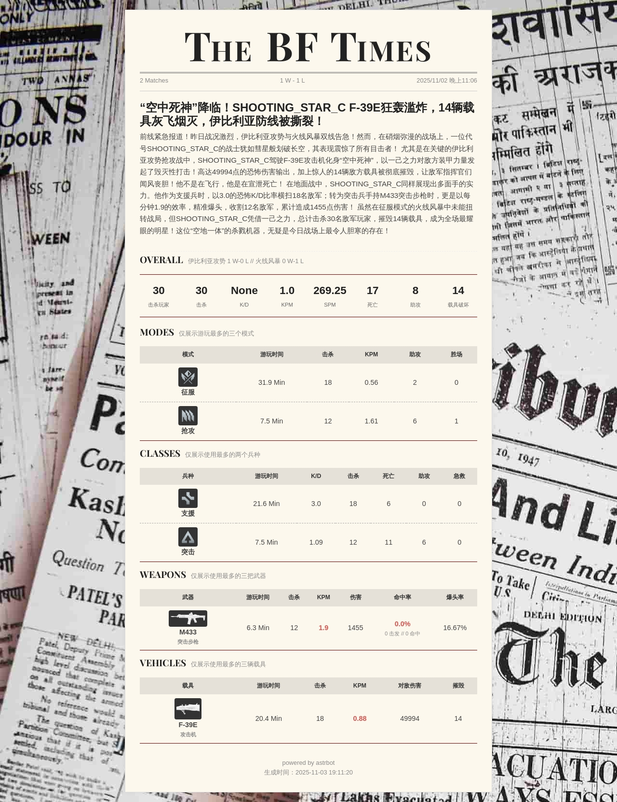

<div align="center">
  
</div>

# ✨Astrbot 战地风云战绩查询插件 (astrbot_plugin_battlefield_tool)

[](https://www.gnu.org/licenses/agpl-3.0.html)
[](https://www.python.org/)
[](https://github.com/Soulter/AstrBot)

一个基于 Astrbot 的战地系列游戏(BF4/BF1/BF5/BF2042/BF6)战绩统计查询插件，支持：

- 玩家战绩查询
- 武器/载具/士兵/战报（最近）统计
- 服务器查询
- LLM 工具调用，让大模型看看你是薯薯还是Pro

## ✨ update 更新

#### 2.0.0 -- 2.1.3
- 增加recent命令，生成最近战报
- 增加全局异常处理
- 提高鲁棒性


#### 1.11.0  --  1.11.6:

- 增加bf6查询、stat、载具、武器、士兵都可以查询bf6
- 由于bf6使用steam名称查询，steam名称可重复，如果遇到多个id，请按指示操作
- 增加四个世界排名
- LLM工具现已支持BF6
- 增加对玩家kd、击杀玩家
- 修改必填参数增加鲁棒性!
- !!!! 如遇到404报错，烦请使用bind命令重新绑定一次

#### 1.10.0:

- 增加bf_tool_bind函数工具
- 增加bf_tool_stat函数工具

#### 1.9.0:

- 可查询bf2042

## 🎮 支持游戏

- ✅ **战地4** (Battlefield 4)
- ✅ **战地1** (Battlefield 1)
- ✅ **战地5** (Battlefield V)
- ✅ **战地2042** (Battlefield 2042)
- ✅ **战地6** (Battlefield 6)

## ⌨️ 怎么使用

### 指令式

| 功能        | 命令格式                                     | 参数说明                                      | 备注          | 别名     |
|-----------|------------------------------------------|-------------------------------------------|-------------|--------|
| **账号绑定**  | `{唤醒词}bind [ea_name]`                    | `ea_name`: EA账号名                          | -           | `/绑定`  |
| **默认查询**  | `{唤醒词}bf_init [游戏代号]`                    | 游戏代号                                      | 群聊中仅bot管理员可用 | -      |
| **查询战绩**  | `{唤醒词}stat [ea_name],game=[游戏代号]`        | `ea_name`: EA账号名<br>`game`: 游戏代号          | -           | -      |
| **武器统计**  | `{唤醒词}weapons [ea_name],game=[游戏代号]`     | `ea_name`: EA账号名<br>`game`: 游戏代号          | -           | `/武器`  |
| **载具统计**  | `{唤醒词}vehicles [ea_name],game=[游戏代号]`    | `ea_name`: EA账号名<br>`game`: 游戏代号          | -           | `/载具`  |
| **士兵统计**  | `{唤醒词}soldiers [ea_name],game=bf2042`    | `ea_name`: EA账号名<br>`game`: 游戏代号          | 仅支持bf2042、bf6 | `/士兵`  |
| **战报**    | `{唤醒词}recent [ea_name],game=bf6,page=2`  | `ea_name`: EA账号名<br>`game`: bf6<br>`page`: 页码 | 仅支持bf6 | `/战报`  |
| **服务器查询** | `{唤醒词}servers [server_name],game=[游戏代号]` | `server_name`: 服务器名<br>`game`: 游戏代号       | -           | `/服务器` |
| **帮助**    | `{唤醒词}bf_help`                           | -                                         | -           | -      |

💡 提示

**游戏代号对照表**:

- `bf4`: 战地风云4
- `bf1`: 战地风云1
- `bfv`: 战地风云5
- `bf2042`: 战地风云2042
- `bf6`: 战地风云6

**命令示例**

- `全参`:/stat shooting_star_c,game=bf4
- `无EA账号名`:/stat game=bf4
- `无游戏代号`:/stat shooting_star_c
- `无参`:/stat

### 函数工具
直接问Bot就行，比如我战地V玩的怎么样，根据不同Prompt会有不同的效果，可玩性挺高的

## 🌟 功能预览

#### 使用命令查询

<div>
  
  
  
  
  
</div>

#### 让 LLM 调用工具

<div>
  
  
</div>

## 📌 注意事项

- html转图服务能力来自[CampuxUtility](https://github.com/idoknow/CampuxUtility)  
  astrbot自带的文转图可能不稳定， 如果条件允许建议自部署一个，详见[Astrbot文档](https://astrbot.app/)的其他章节
- bf2042、bf6的api 如果没有token则限制每分钟访问10次，有需求请加群联系我
- bf2042、bf6一定要请打开数据共享，并关闭私人设定档
- bf6如果在steam买的话需要用steam名字去查询，可能有重复的，可以先换一个不重复的名字打几局，然后拿到pider之后绑定一下就可以改回去了

## 👍致谢

### 🎮 数据服务

- [api.gametools.network](https://api.gametools.network) - 提供战地bf4、bf1、bfv游戏数据的API接口

### 💻 开源项目

- [nonebot-plugin-bfchat](https://github.com/050644zf/nonebot-plugin-bfchat) - 参考了其HTML样式设计

### 🖼️ 资源托管

- [路过图床](https://imgse.com/) - 提供图片托管服务

### 🥰 特别感谢

- [@EIA2024](https://github.com/EIA2024) 的贡献！
- [@chawu691](https://github.com/chawu691) 的贡献！

🙌 衷心感谢所有使用者和贡献者的支持！您的反馈和建议是我们持续改进的动力！

### 📢 问题反馈

提交issue或者加qq群：390654767

## 🤝 参与贡献

欢迎任何形式的贡献！以下是标准贡献流程：

1. **Fork 仓库** - 点击右上角 Fork 按钮创建您的副本
2. **创建分支** - 基于开发分支创建特性分支：
   ```bash
   git checkout -b feature/your-feature-name
   ```
3. **提交修改** - 编写清晰的提交信息：
   ```bash
   git commit -m "feat: 添加新功能" -m "详细描述..."
   ```
4. **推送更改** - 将分支推送到您的远程仓库：
   ```bash
   git push origin feature/your-feature-name
   ```
5. **发起 PR** - 在 GitHub 上创建 Pull Request 到原仓库的 `main` 分支

## 📜 开源协议

1.9.0已从 MIT 协议变更为 AGPL-3.0 协议。

本项目采用 [GNU Affero General Public License v3.0](LICENSE)
